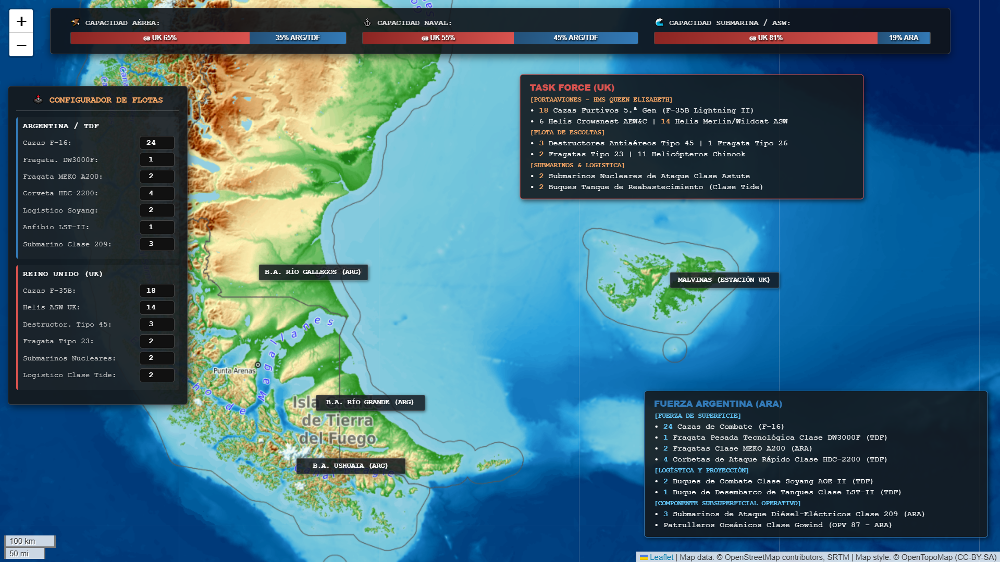

# 🗺️ Atlántico Sur - Simulador Táctico Interactivo (2027)

¡Bienvenido al **Simulador Estratégico del Atlántico Sur**! Este proyecto es un tablero de control táctico basado en mapas interactivos y entornos web empotrados en Python. Permite modelar, auditar y balancear en tiempo real un escenario de operaciones hipotético en la Patagonia y el mar austral, evaluando el equilibrio de fuerzas entre la **Task Force del Reino Unido** y la **Flota de Mar combinada de Argentina y Tierra del Fuego (ARG/TDF)**.

## 📊 Vista General del Teatro de Operaciones

Al iniciar el mapa, la interfaz despliega los bloques infográficos directamente sobre el océano y una barra superior de balance de poder predictivo, optimizada para un análisis de situación inmediato.



---

## 🕹️ Características Principales

*   **Mapa Topográfico Limpio:** Basado en `OpenTopoMap` mediante la librería `Folium`, resaltando el relieve de la Cordillera de los Andes, la estepa patagónica y el talud continental sin saturar la visual con íconos innecesarios.
*   **Configurador de Flotas en Tiempo Real:** Un panel de control lateral izquierdo programado en JavaScript que permite sumar o restar unidades (cazas, destructores, fragatas, submarinos y helicópteros ASW) mediante selectores numéricos.
*   **Matemática Operacional de Capacidades:** Las barras de estado superiores recalculan dinámicamente el balance porcentual aplicando ponderaciones técnicas de peso militar por unidad (ej. ventajas de sigilo de 5.ª generación para los cazas F-35B o persistencia de propulsión profunda para los SSN nucleares).
*   **Nomenclatura y Jerarquía unificada:** Clasificación clara de los componentes estratégicos litorales e internacionales (`ARA`, `TDF`, `UK`).

---

## 🛠️ Tecnologías Utilizadas

*   **Python 3.x** - Núcleo de generación del entorno gráfico.
*   **Folium** - Renderizado del mapa interactivo y manipulación de capas geográficas.
*   **HTML5 / CSS3 / JavaScript (ES6)** - Interfaz de usuario inyectada dinámicamente para la reactividad en tiempo real y adaptabilidad a dispositivos móviles.

---

## 🚀 Instalación y Ejecución Rápida

1. **Clonar el repositorio** o descargar el script `escenario.py`:
   ```bash
   [git clone https://github.com/ZeusOneRG/simulador_malv/]
   cd TU_REPOSITORIO
   ```

2. **Instalar los requisitos previos** desde la terminal:
   ```bash
   pip install folium
   ```

3. **Ejecutar el generador del escenario táctico**:
   ```bash
   python escenariointeractivo4.py
   ```

4. **Visualizar el simulador**:
   El script generará un archivo dinámico independiente llamado `mapa_atlantico_sur.html` en la raíz del directorio. Simplemente haz doble clic sobre él o arrástralo a tu navegador web de preferencia (Chrome, Edge, Firefox) para operar el panel táctico.

---

## 📐 Parámetros de Ponderación Militar (Lógica de Cómputo)

El simulador aplica las siguientes variables de peso táctico para actualizar las barras de balance superior:

*   **Capacidad Aérea:** Cada caza furtivo F-35B británico computa con un peso relativo de `2.5 puntos` (debido a su arquitectura de quinta generación y alerta temprana Crowsnest embarcada), mientras que las unidades terrestres regionales computan a razón de `1.0 punto` por casco.
*   **Capacidad Naval:** Las fragatas de última generación `DW3000F` y destructores de zona de defensa aérea `Tipo 45` se computan con un peso de `4.0` y `4.2` puntos respectivamente, garantizando que la masa crítica de escoltas afecte el control de superficie.
*   **Capacidad Submarina / ASW:** Equilibra la ventaja de patrulla ilimitada de los submarinos nucleares británicos de la clase `Astute` (`4.0 puntos`) permitiendo contrarrestarla mediante el despliegue de helicópteros de guerra antisubmarina `Merlin/Wildcat` (`0.8 puntos` c/u) y la estrategia de emboscada litoral de los diésel-eléctricos clase `209` argentinos.

---
*Nota: Este proyecto ha sido desarrollado con fines recreativos de simulación logística, geoestratégica y de programación interactiva.*
